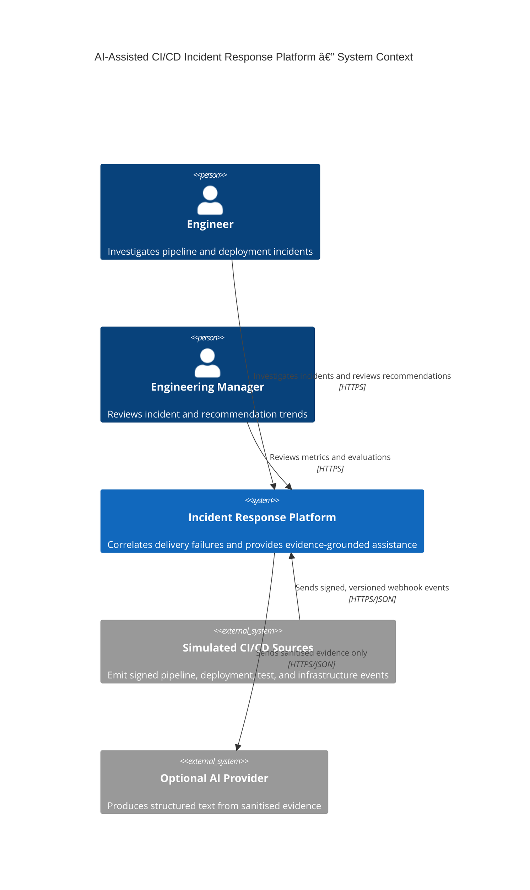
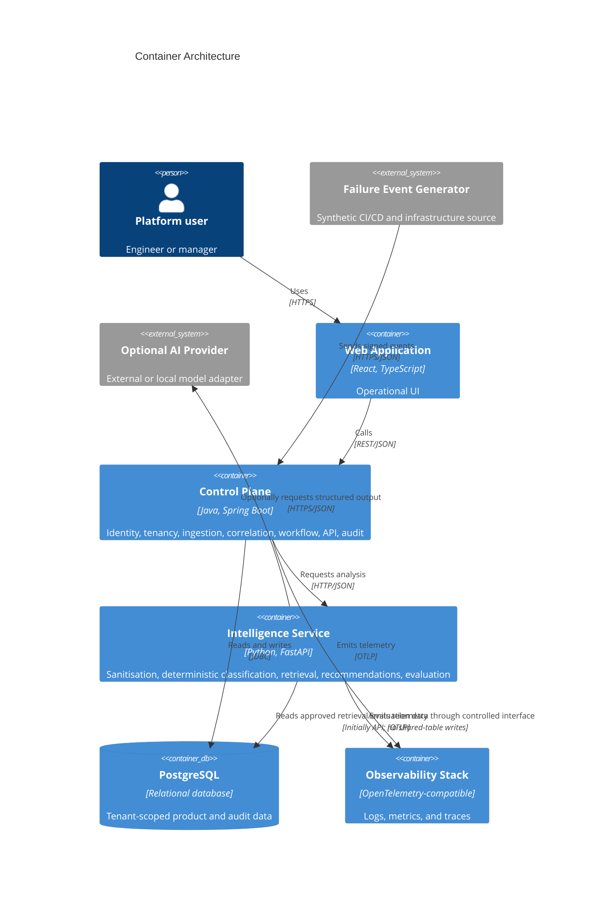
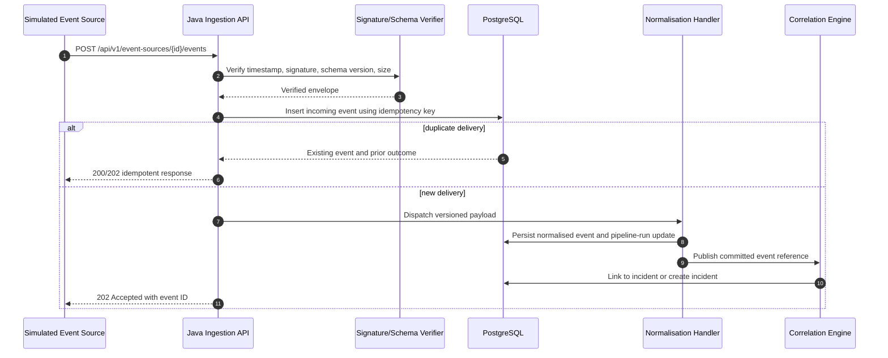
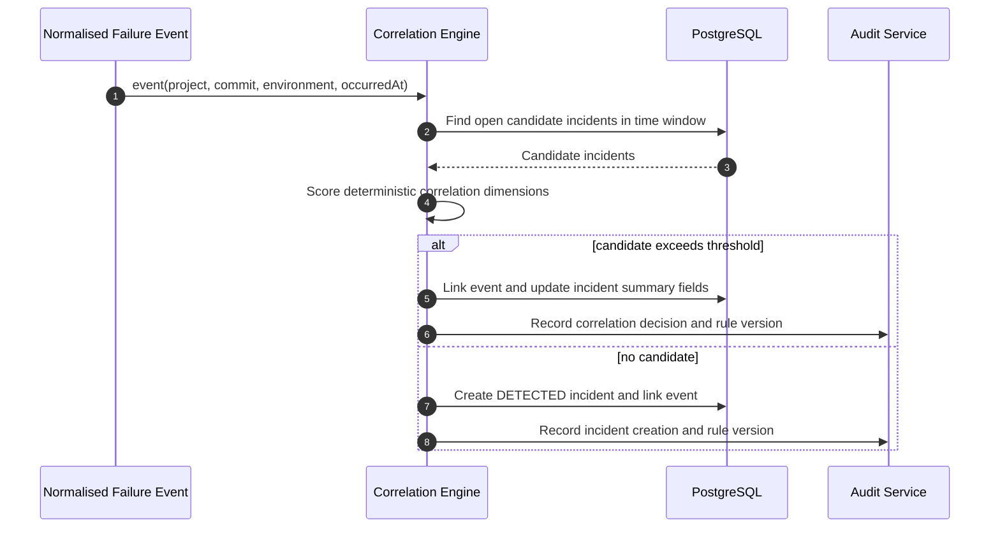
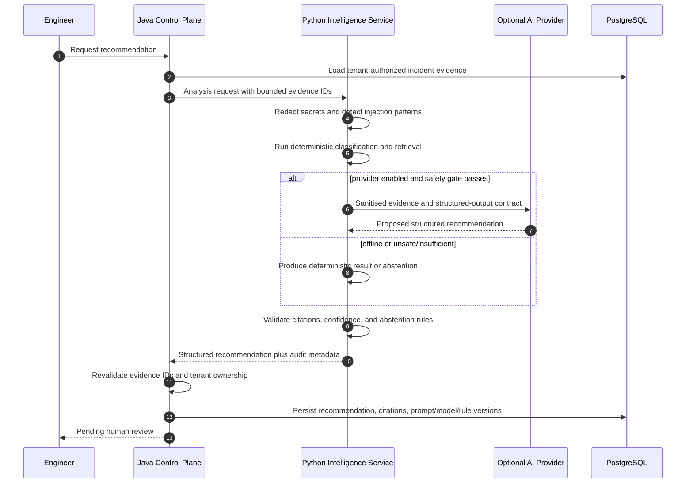
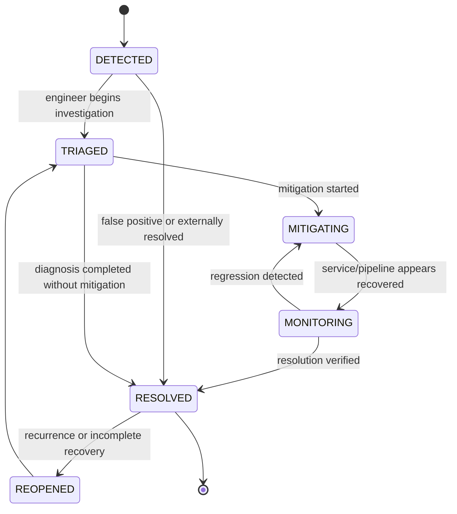
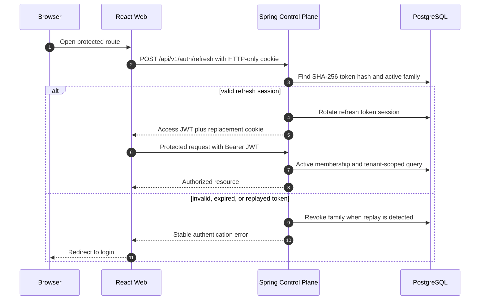

# Architecture

## Architectural style

The system is a modular monorepo containing three deployable applications and supporting infrastructure:

1. A Java control plane owns identity, tenancy, ingestion, workflow, persistence, APIs, and auditability.
2. A Python intelligence service owns sanitisation, classification, retrieval, recommendation generation, and evaluation.
3. A React web application provides operational and governance workflows.

The initial release deliberately uses a modular monolith for the Java control plane rather than many Java microservices. This keeps local operation and transactional consistency manageable while preserving clear module boundaries that can later be extracted.

## C4 context

## Container architecture

## Control-plane modules

- `identity`: users, credentials, authentication tokens, and account lifecycle.
- `tenancy`: organisations, memberships, roles, projects, and tenant access policies.
- `eventsource`: source configuration, signing-secret metadata, and source status.
- `ingestion`: signature verification, idempotency, schema dispatch, and raw event persistence.
- `pipeline`: normalised events, pipeline runs, stages, jobs, and searchable timelines.
- `incident`: correlation, incident lifecycle, linked evidence, and state transitions.
- `recommendation`: requests, structured results, citations, review status, and version history.
- `resolution`: final human-authored outcomes and reusable historical knowledge.
- `evaluation`: benchmark definitions, runs, results, and quality metrics.
- `audit`: append-only security and business audit events.
- `shared`: narrowly scoped technical primitives such as identifiers, clocks, pagination, and error contracts.

Modules must not directly access another module's repository implementation. They communicate through application services, explicit ports, or published in-process domain events.

## Data ownership

PostgreSQL is the system of record. Each tenant-owned row contains an `organisation_id` or is reachable only through an aggregate that contains it. Application-level authorization is mandatory for every query; database row-level security is evaluated in Phase 13 as defence in depth.

Raw event payloads and normalised fields are stored separately. Raw payload retention is limited and configurable. Sanitised log content is stored separately from original log content so the system can prove which representation was supplied to an AI provider.

The Python service does not write directly into control-plane domain tables. It receives a bounded analysis request and returns a validated structured response. The Java control plane validates evidence references and persists the recommendation and audit metadata transactionally.

## Event ingestion sequence

## Incident correlation sequence

## AI recommendation sequence

## Incident state machine

State transitions are performed by a domain service, guarded by role and current-state checks, and recorded as incident timeline and audit events. Records are not physically deleted through normal product workflows.

## Trust boundaries

1. Browser to control-plane API.
2. Simulated webhook source to ingestion API.
3. Java control plane to Python intelligence service.
4. Python intelligence service to optional model provider.
5. Services to PostgreSQL and observability backends.

Untrusted log text is data, never instruction. It is delimited, size-limited, sanitised, and excluded from system/developer instruction channels in provider adapters.

## Principal quality attributes

- **Auditability:** every correlation, recommendation, review, and state transition has actor and version metadata.
- **Safety:** abstention is a successful outcome; no autonomous remediation exists.
- **Security:** signed events, tenant checks, rate limits, least privilege, and secret redaction.
- **Operability:** deterministic local mode, health endpoints, metrics, traces, and synthetic scenarios.
- **Testability:** pure correlation/classification policies, contract tests, Testcontainers, and fixed evaluation cases.
- **Evolvability:** versioned event schemas and provider interfaces isolate external changes.

## Phase 2 identity and tenancy architecture

The Java control plane remains the authoritative security boundary. The frontend controls navigation and user experience but cannot grant access. Organisation membership and repository scoping are both required for tenant-owned resource access.
