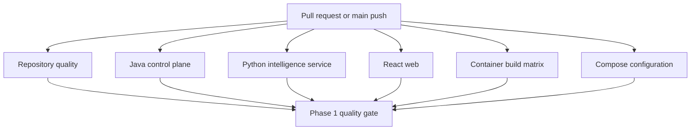

# Continuous Integration

## Workflow overview

The primary workflow is:

```text
.github/workflows/ci.yml
```

It runs for pull requests, pushes to `main`, and manual dispatch.



## Required jobs

### Repository quality

Checks:

- Required foundation files exist.
- No unresolved implementation markers exist in owned source.
- Generated dependency, build, and report directories are not tracked.
- Git whitespace validation passes.

### Java control plane

Runs:

```text
./gradlew clean check bootJar --no-daemon --no-configuration-cache
```

This includes formatting verification, static analysis, unit and integration tests, JaCoCo reporting, and executable JAR creation.

### Python intelligence service

Runs:

```text
python -m uv lock --check
python -m uv sync --frozen
python -m uv run ruff format --check .
python -m uv run ruff check .
python -m uv run mypy
python -m uv run pytest
```

### React web application

Runs:

```text
npm ci
npm run format:check
npm run lint
npm run test
npm run build
npm run test:e2e
```

Playwright Chromium is installed with its Linux dependencies before browser testing.

### Container build matrix

Builds without publishing:

- Control plane.
- Intelligence service.
- Web application.

### Compose configuration

Renders and validates the merged Compose model using `.env.example`.

### Aggregate quality gate

The final job fails unless every required job succeeds. Configure branch protection to require:

```text
Phase 1 quality gate
```

## Dependency Review

The pull-request-only dependency workflow fails when a changed dependency introduces a vulnerability rated high or critical.

## Dependabot

Dependabot checks weekly for:

- Gradle dependencies.
- Python dependencies.
- npm dependencies.
- Docker base images.
- GitHub Actions.

Updates still require normal human review and passing CI.

## Artifacts

CI retains Java reports, Python coverage, and frontend test reports for 14 days.

Artifacts are supporting evidence. They are not a substitute for reviewing failing logs and do not contain production secrets.

## Local parity

Before pushing:

```powershell
.\scripts\verify-repository.ps1

Set-Location .\services\control-plane
.\gradlew.bat clean check bootJar --no-configuration-cache

Set-Location ..\intelligence-service
python -m uv lock --check
python -m uv run ruff format --check .
python -m uv run ruff check .
python -m uv run mypy
python -m uv run pytest

Set-Location ..\..\web
npm run format:check
npm run lint
npm run test
npm run build
npm run test:e2e

Set-Location ..
docker compose config --quiet
docker compose build
```

## Branch protection recommendation

Protect `main` with:

- Pull requests required before merging.
- Required approval count appropriate for the repository.
- Conversation resolution required.
- Branches required to be up to date before merging.
- `Phase 1 quality gate` required.
- `Review dependency changes` required when the workflow runs.
- Force pushes and deletions disabled.
