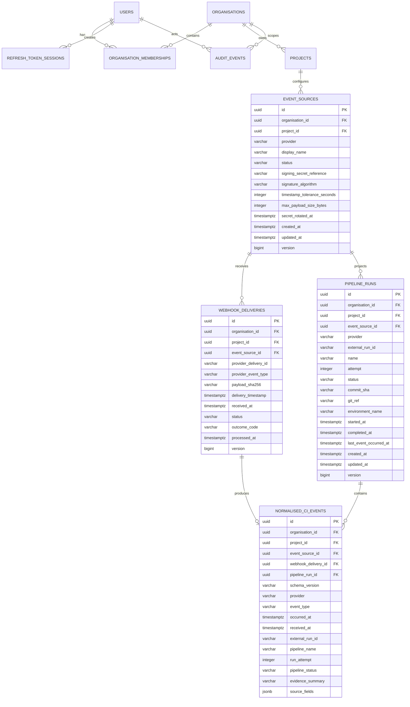

# Data Model

## Identity, tenancy, and event-ingestion entities

The Phase 2 identity tables remain unchanged: users, organisations, memberships,
projects, refresh-token sessions, and audit events continue to provide the
authentication and tenant boundary for the ingestion model.

## Event-ingestion constraints

- Every event-ingestion row carries `organisation_id` and `project_id` explicitly.
- Composite foreign keys prevent an event source, delivery, run, or event from combining identifiers from different tenants.
- `(project_id, display_name)` is unique for event sources.
- Signing secrets are not stored in this model. `signing_secret_reference` is an opaque lookup reference and must never be returned by read APIs or logged.
- `(event_source_id, provider_delivery_id)` is unique and forms the database idempotency boundary.
- Only the SHA-256 digest of exact payload bytes is retained by the delivery record; raw request bodies and signatures are not persisted.
- Delivery status is `RECEIVED`, `PROCESSED`, `REJECTED`, `FAILED`, or `PROCESSING_RETRY`.
- `(event_source_id, external_run_id, attempt)` uniquely identifies a pipeline attempt.
- Terminal pipeline runs require `completed_at`; non-terminal runs cannot have it.
- One webhook delivery produces at most one normalised CI event in Phase 3.
- Normalised `source_fields` must be a JSON array of provider-field paths used as deterministic evidence.
- Mutable aggregates use optimistic-lock version columns.
- UUIDs are generated by the application and timestamps use PostgreSQL `timestamptz`.

## Retention and trust

Provider payloads and identifiers are untrusted. The persistence model deliberately
stores only bounded, normalised fields needed for idempotency, pipeline projection,
auditability, and later incident correlation. Log fragments and model inputs are
separate later-phase concerns and must not be placed in these tables.

Later phases add incidents, incident timelines, redacted log fragments,
recommendations, evidence citations, human feedback, resolutions, and evaluation cases.
