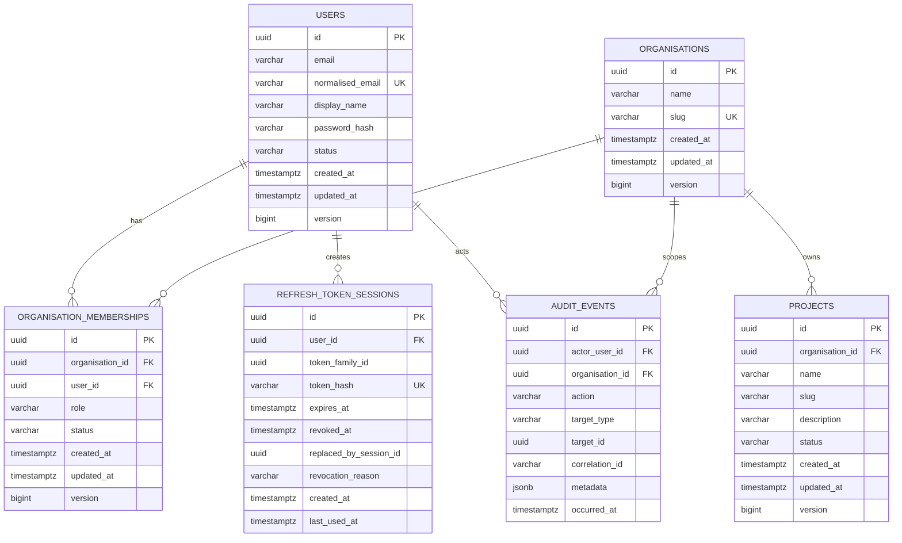

# Data Model

## Phase 2 identity and tenancy entities

## Constraints

- `users.normalised_email` is globally unique.
- `(organisation_id, user_id)` is unique for memberships.
- Membership role is `OWNER`, `ADMIN`, `MEMBER`, or `VIEWER`.
- Membership status is `ACTIVE` or `SUSPENDED`.
- `(organisation_id, slug)` is unique for projects.
- Project status is `ACTIVE` or `ARCHIVED`.
- Only refresh-token hashes are persisted.
- Mutable aggregates use optimistic-lock version columns.
- UUIDs are generated by the application.
- Timestamps use PostgreSQL `timestamptz` and UTC ISO-8601 at API boundaries.

Later phases add event sources, events, pipeline runs, incidents, logs, recommendations, evidence, feedback, resolutions, and evaluation cases. Each tenant-owned entity must reference its project or organisation explicitly.