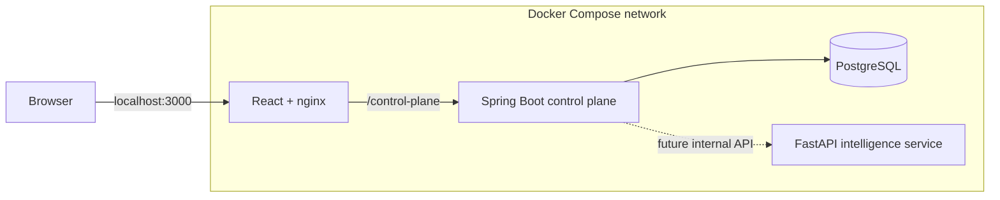

# Deployment and Local Orchestration

## Phase 1 scope

Phase 1 provides a repeatable local Docker Compose environment. It is not yet a production deployment architecture.

The environment contains:

- PostgreSQL.
- Spring Boot control plane.
- FastAPI intelligence service.
- React/nginx web application.
- One isolated bridge network.
- One named PostgreSQL volume.
- Container health checks.
- Dependency-aware startup ordering.

## Topology



The browser does not call the intelligence service directly. The intelligence port is exposed locally for foundation testing and OpenAPI inspection.

## Environment preparation

From the repository root:

```powershell
Copy-Item .env.example .env
```

The `.env` file is ignored by Git. Never store production credentials in it.

## Validate configuration

```powershell
docker compose config
```

This renders the merged base and override files and detects malformed Compose configuration.

## Build

```powershell
docker compose build
```

For a clean rebuild:

```powershell
docker compose build --no-cache
```

## Start

```powershell
docker compose up -d
```

Watch startup:

```powershell
docker compose ps
docker compose logs --follow
```

## Local endpoints

| Component | URL |
|---|---|
| Web application | `http://localhost:3000` |
| Control-plane status | `http://localhost:8080/api/v1/system/status` |
| Control-plane health | `http://localhost:8080/actuator/health` |
| Control-plane Swagger UI | `http://localhost:8080/swagger-ui.html` |
| Intelligence status | `http://localhost:8000/api/v1/system/status` |
| Intelligence health | `http://localhost:8000/health/ready` |
| Intelligence OpenAPI | `http://localhost:8000/docs` |
| PostgreSQL | `localhost:5432` |

## Automated local verification

```powershell
.\scripts\verify-local-stack.ps1
```

The script checks both backend health endpoints, both system-status endpoints, and the web application.

## Stop

Retain PostgreSQL data:

```powershell
docker compose down
```

Delete the disposable local volume:

```powershell
docker compose down --volumes
```

## Logs

All services:

```powershell
docker compose logs
```

One service:

```powershell
docker compose logs control-plane
docker compose logs intelligence-service
docker compose logs web
docker compose logs postgres
```

## Common failures

### A port is already in use

Change the relevant value in `.env`:

```text
POSTGRES_PORT
CONTROL_PLANE_PORT
INTELLIGENCE_SERVICE_PORT
WEB_PORT
```

Container-to-container ports remain unchanged.

### Control plane remains unhealthy

Inspect:

```powershell
docker compose logs postgres
docker compose logs control-plane
```

The control plane waits for PostgreSQL health before starting. Flyway must complete before the application becomes healthy.

### Web starts but shows control plane unavailable

Confirm:

```powershell
docker compose ps
docker compose logs web
docker compose logs control-plane
```

The nginx `/control-plane/` route resolves the Compose service name `control-plane`.

### Docker rebuild uses stale layers

Run:

```powershell
docker compose build --no-cache
docker compose up -d --force-recreate
```

## Production limitations

This Compose definition is not production-ready because it does not yet include:

- TLS termination.
- Secret-manager integration.
- External managed PostgreSQL.
- Image registry publication.
- Resource limits based on measured workloads.
- Multi-instance services.
- Backup and restore automation.
- Production observability infrastructure.
- Kubernetes manifests.

These are documented limitations rather than hidden assumptions.
