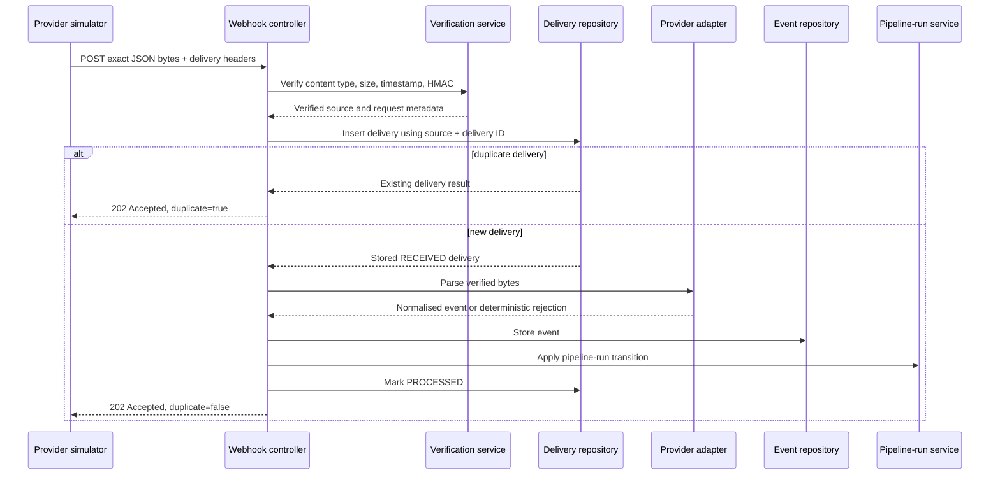
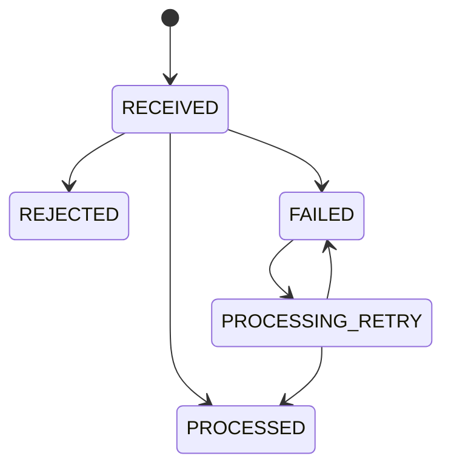

# Secure Event Ingestion

## Scope

Phase 3 receives simulated CI/CD webhooks, authenticates the sender, rejects stale or malformed requests, stores an auditable delivery record, normalises supported events, and updates pipeline-run state.

It does not perform AI analysis, incident correlation, log ingestion, or remediation.

## Trust boundaries

```mermaid
flowchart LR
    Simulator[Signed webhook simulator]
    Edge[Webhook controller]
    Verify[Signature and replay verification]
    Delivery[Webhook delivery store]
    Adapter[Provider adapter]
    Events[Normalised event store]
    Runs[Pipeline run projection]

    Simulator -->|Untrusted HTTPS payload| Edge
    Edge --> Verify
    Verify -->|Verified exact bytes| Delivery
    Delivery --> Adapter
    Adapter --> Events
    Events --> Runs
```

The request body, headers, provider names, external identifiers, commit messages, branch names, and evidence summaries are untrusted.

## Processing sequence

## Event-source configuration

An event source belongs to exactly one project and therefore one organisation. It contains:

- provider type
- display name
- enabled state
- encrypted or externally supplied signing secret reference
- signature algorithm
- timestamp tolerance
- maximum payload size
- creation and rotation metadata

Signing secrets are never returned by read APIs and never logged.

## Signature verification

1. Resolve the event source from the URL.
2. Reject disabled or unknown sources without disclosing tenant details.
3. Require `application/json`.
4. Enforce the byte-size limit before parsing.
5. Parse and validate the delivery timestamp.
6. Reject timestamps outside the configured tolerance.
7. Compute HMAC-SHA-256 over the exact request bytes.
8. Decode the supplied lowercase hexadecimal signature.
9. Compare signatures using a constant-time operation.
10. Continue only after all verification checks pass.

Verification failures do not create normalised events or pipeline-run changes.

## Replay protection and idempotency

Replay protection and idempotency are related but separate:

- Timestamp validation rejects stale captured requests.
- The unique key `(event_source_id, delivery_id)` prevents repeated processing.
- A valid retry with the same delivery ID returns the original deterministic acceptance result.
- A reused delivery ID with different payload bytes is rejected as a conflict and recorded for audit.
- Side effects occur only for the transaction that successfully creates the delivery record.

## Delivery lifecycle

`REJECTED` represents deterministic validation or unsupported-event outcomes. `FAILED` represents an internal processing failure eligible for controlled human-triggered retry in a later batch.

## Pipeline-run projection

A pipeline run is identified within a project by provider, event source, and external run identifier. Updates must be applied only within that tenant boundary.

Allowed progression is evidence-driven. For example:

- `QUEUED` to `RUNNING`
- `RUNNING` to a terminal status
- an existing terminal status may be corrected only by a later provider event with stronger ordering evidence

Out-of-order events are retained but must not silently regress a terminal run to a non-terminal state.

## Failure responses

- `202 Accepted`: verified and accepted, including idempotent duplicates
- `400 Bad Request`: malformed headers or JSON
- `401 Unauthorized`: invalid signature
- `404 Not Found`: unknown or inaccessible event source
- `409 Conflict`: delivery ID reused with different payload bytes
- `413 Payload Too Large`: body exceeds configured limit
- `415 Unsupported Media Type`: content type is not JSON
- `422 Unprocessable Entity`: verified but unsupported or semantically invalid provider event
- `429 Too Many Requests`: future rate-limit enforcement

Error responses use stable error codes and correlation identifiers. They do not echo raw payloads or signing material.

## Observability

Structured logs and metrics must include safe identifiers:

- event source ID
- project ID
- provider
- delivery outcome
- duplicate flag
- processing duration
- adapter result
- correlation ID

They must not include signatures, secrets, bearer tokens, refresh tokens, or raw payload bodies.

## Non-goals

Phase 3 does not:

- accept production provider credentials
- fetch remote logs
- invoke an AI model
- infer root causes
- correlate incidents
- perform remediation
- automatically retry destructive operations
