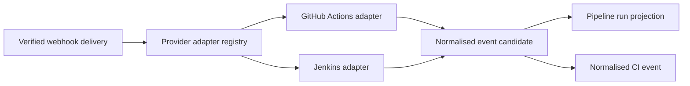

# Provider adapters and normalised event processing

Batch 4 introduces a deterministic adapter boundary between authenticated webhook deliveries and the provider-neutral event model.

## Boundary

Adapters receive the provider event type, parsed JSON, and receipt-time fallback. They return only typed fields required by the provider-neutral model. Raw bodies and signatures are never persisted by the normalisation path.

## Supported mappings

| Provider | Input | Normalised event | Status source |
|---|---|---|---|
| GitHub Actions | `workflow_run` | started/completed | `status` and `conclusion` |
| Jenkins | build payload | started/completed | `build.result` or `build.status` |

Unknown provider event types are accepted after signature verification and marked as processed with `UNSUPPORTED_PROVIDER_EVENT`. This keeps authentication and delivery idempotency separate from the evolving provider schema catalogue.

## Evidence boundary

Each normalised event stores an evidence summary and a list of safe source-field names. It does not store raw provider payloads, webhook signatures, or signing secrets. Later log-analysis work must use explicitly retained, redacted evidence fragments rather than implicitly trusting provider input.
